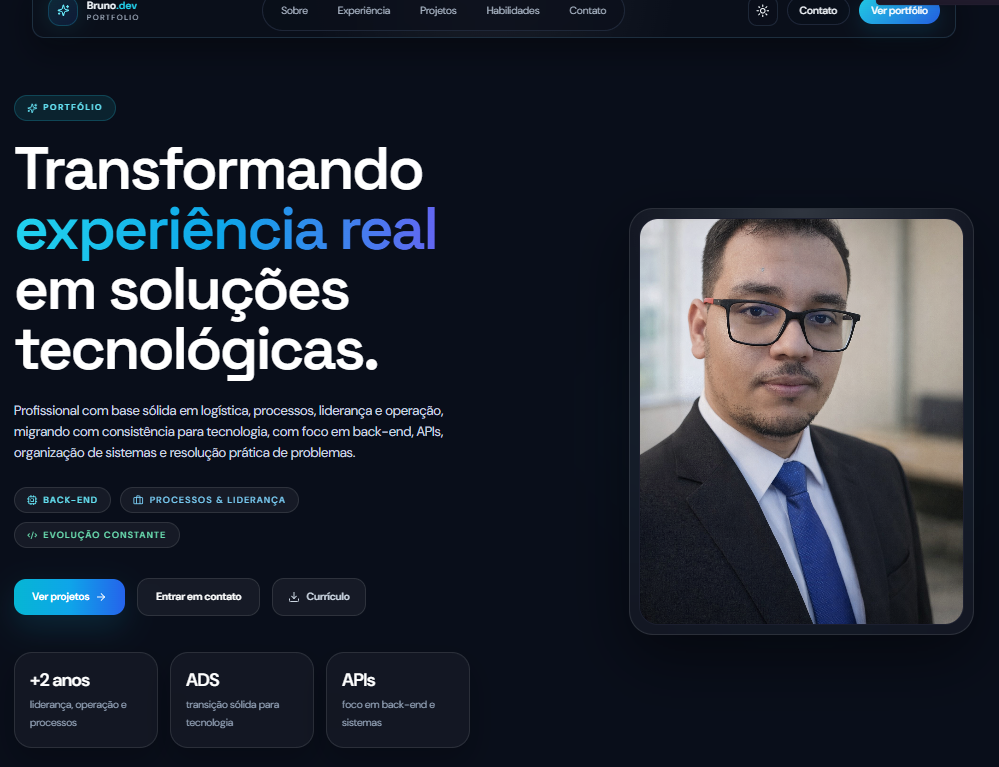

# 💼 Bruno Alves Lopes | Portfólio Fullstack com IA

## 🚀 Preview do projeto

[](https://bruno-portfolio-six.vercel.app)

🔗 **Acesse o projeto online:**  
https://bruno-portfolio-six.vercel.app

---

## 📌 Sobre o projeto

Portfólio desenvolvido com foco em demonstrar habilidades práticas em desenvolvimento web moderno, incluindo integração com Inteligência Artificial.

---

## 🚀 Tecnologias utilizadas

### 🎨 Frontend
- React + Vite
- TypeScript
- Tailwind CSS
- Framer Motion

### ⚙️ Backend
- Node.js
- Express
- Integração com IA (OpenAI / Gemini)
- Rate limit e segurança básica

### 🌐 Deploy
- Frontend: Vercel
- Backend: Render

---

## 🤖 Funcionalidades

- Chat interativo com IA
- Interface moderna e responsiva
- Integração frontend + backend em produção
- Estrutura fullstack organizada
- Consumo de API em tempo real

---

## 🧠 Diferenciais do projeto

- Aplicação fullstack em produção
- Integração com Inteligência Artificial
- Deploy profissional (Vercel + Render)
- Boas práticas de organização de código
- Separação de responsabilidades (frontend/backend)

---

## 📂 Estrutura do projeto

```bash
bruno-portfolio/
│
├── frontend/   # Aplicação React (Vercel)
├── backend/    # API Node.js (Render)

---

⚙️ Como rodar o projeto localmente
📥 Clone o repositório
git clone https://github.com/bruno-alves-lopes-dev/bruno-portfolio.git
▶️ Frontend
cd frontend
npm install
npm run dev
⚙️ Backend
cd backend
npm install
npm start
🔐 Variáveis de ambiente
Frontend (.env)
VITE_API_BASE_URL=http://localhost:3000
Backend (.env)
OPENAI_API_KEY=sua_chave
# ou
GEMINI_API_KEY=sua_chave
🎯 Objetivo

Este projeto foi desenvolvido com o objetivo de consolidar conhecimentos em desenvolvimento web e demonstrar a capacidade de construir aplicações completas, integrando frontend, backend e serviços externos.

👨‍💻 Autor

Bruno Alves Lopes

📧 Bruno.alves.lopes.dev@gmail.com

🔗 https://www.linkedin.com/in/bruno-alves-lopes-dev

⭐ Considerações

Se você é recrutador ou desenvolvedor e chegou até aqui, fique à vontade para explorar o projeto. Feedbacks são sempre bem-vindos!